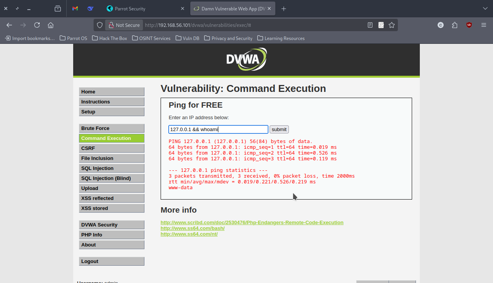
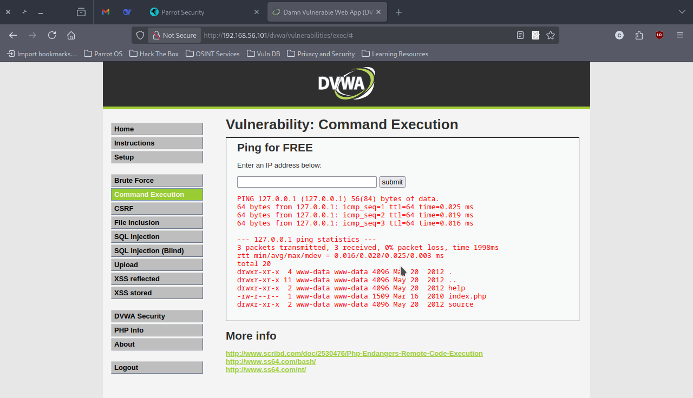
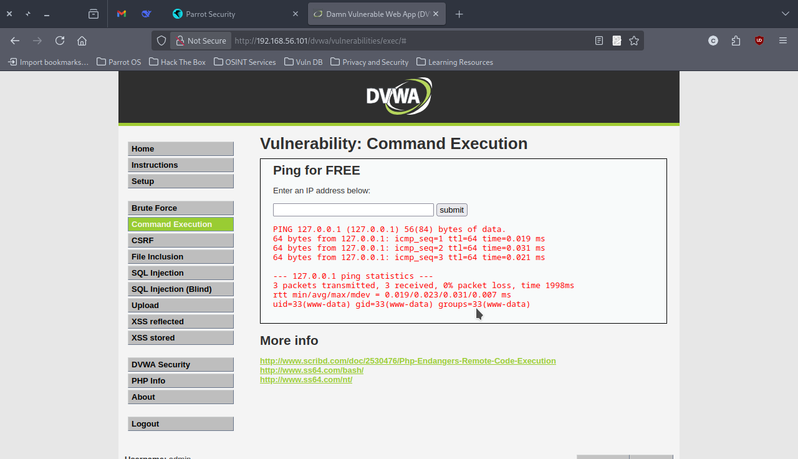
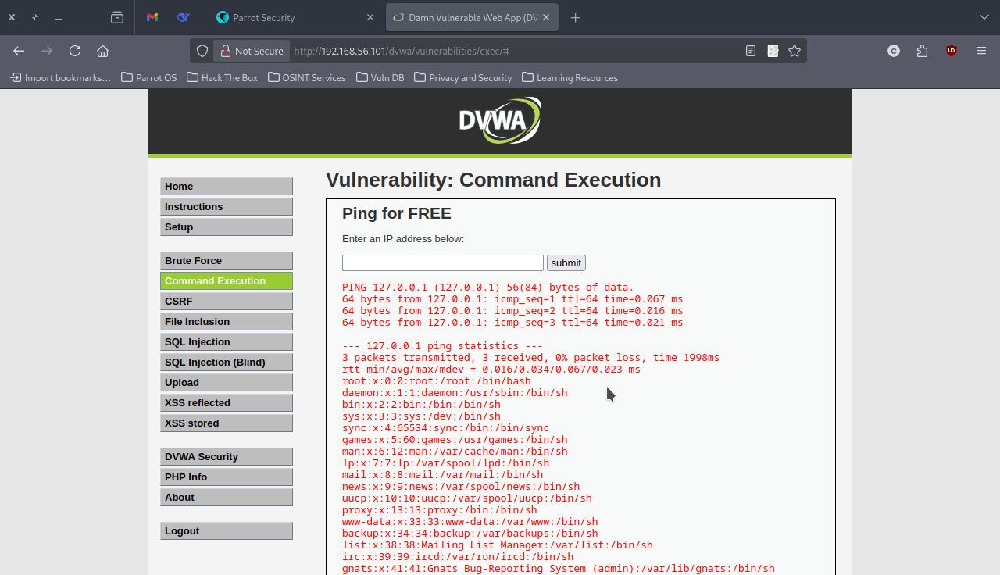
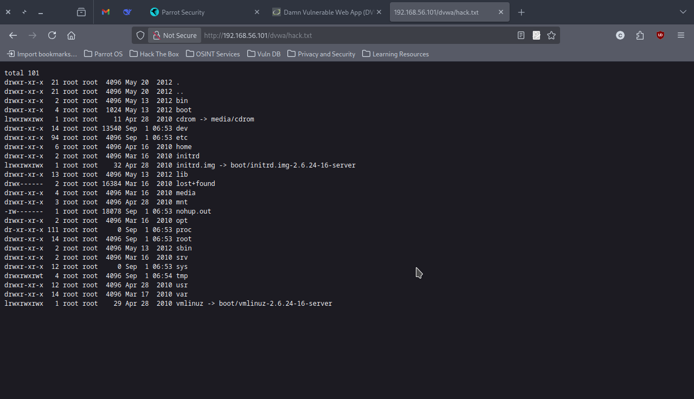
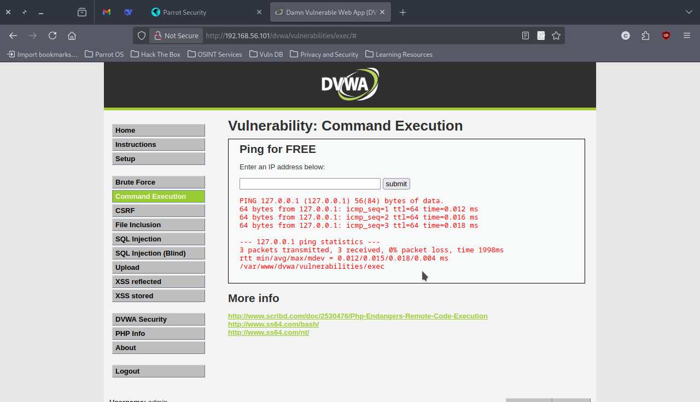

# OS Command Injection Exploitation on DVWA

## Overview

**Focus:** OS Command Injection Vulnerability Assessment  
**Target:** Damn Vulnerable Web Application (DVWA) v1.8  
**Objective:** Identify, exploit, and document command injection flaws in web applications  
**Status:** Successfully Exploited - Critical Vulnerability Confirmed

## Executive Summary

A critical OS Command Injection vulnerability was successfully identified and exploited in the DVWA Command Execution module. The vulnerability allows arbitrary system command execution with web server privileges, providing a pathway for complete system compromise. Testing was conducted in a controlled lab environment on the "Low" security setting to understand the fundamental exploitation techniques before advancing to higher security levels.

## Environment Configuration

| Component | Details |
|-----------|---------|
| **Target Application** | Damn Vulnerable Web Application (DVWA) v1.8 |
| **Target IP** | 192.168.56.101 |
| **Security Level** | Low |
| **Vulnerable Module** | Command Execution (/dvwa/vulnerabilities/exec/) |
| **Attack Vector** | IP Address Input Field |
| **Payload Method** | Command Chaining with `&&` operator |

## Vulnerability Assessment

### Vulnerability Classification
- **Type:** OS Command Injection (CWE-78)
- **CVSS 3.1 Score:** 9.8 (Critical)
- **Attack Vector:** Network
- **Attack Complexity:** Low
- **Privileges Required:** None
- **User Interaction:** None
- **Impact:** Complete system compromise potential

### Technical Analysis

The Command Execution module accepts user input intended for ping operations but fails to implement proper input sanitization. The application directly passes user input to system shell commands using functions like `shell_exec()` or `system()` without validation, enabling command injection through metacharacters.

**Root Cause:** Lack of input validation and unsafe use of system command execution functions.

## Evidence

### Initial Command Injection Confirmation

*Payload: `127.0.0.1 && whoami` - Successfully executed whoami command revealing www-data user context*

### System Information Gathering

*Payload: `127.0.0.1 && ls -la` - Enumerated current directory structure and file permissions*


*Payload: `127.0.0.1 && id` - Confirmed user context and group memberships*

### Sensitive File Access

*Payload: `127.0.0.1 && cat /etc/passwd` - Successfully accessed sensitive system configuration files*

### Data Exfiltration Demonstration

*Output from: `127.0.0.1 && ls -la / > /var/www/dvwa/hack.txt` - Demonstrated data exfiltration capabilities through web-accessible file creation*


*Payload: `127.0.0.1 && pwd` - Revealed application execution context at `/var/www/dvwa/vulnerabilities/exec`*

## Technical Findings

### Successful Exploitation Vectors

1. **Command Chaining:** The `&&` operator successfully chains commands, executing secondary commands after successful ping operations
2. **File System Access:** Full read access to system files including `/etc/passwd`, revealing all user accounts
3. **Directory Traversal:** Ability to navigate and list directory contents throughout the file system
4. **Output Redirection:** Capability to create files in web-accessible directories for data exfiltration
5. **System Enumeration:** Complete system reconnaissance through standard Unix commands

### Privilege Context

- **Execution User:** www-data (uid=33, gid=33)
- **Group Memberships:** www-data group only
- **File Permissions:** Standard web server permissions with read access to system files
- **Write Capabilities:** Can create files in web directories for persistent access

## Skills Developed

- Command injection identification through input field testing
- Payload construction using command chaining operators
- System enumeration techniques in compromised environments
- Data exfiltration methods through web-accessible file creation
- Understanding of web server privilege contexts and limitations
- Documentation of exploitation evidence for security assessments

## Exploitation Results

### Impact Assessment

**Immediate Access:**
- Arbitrary command execution on target system
- System file enumeration and sensitive data access
- Web directory write permissions for persistent access
- Complete system reconnaissance capabilities

**Potential Escalation:**
- Privilege escalation attempts through kernel exploits
- Persistent backdoor installation through cron jobs or startup scripts
- Network lateral movement using compromised system as pivot point
- Data exfiltration of sensitive application and system information

### Business Impact

- **Confidentiality:** Complete compromise - access to all system files and user data
- **Integrity:** System files can be modified, application logic can be altered
- **Availability:** Potential for denial of service through resource exhaustion or system damage

## Defensive Recommendations

### Immediate Actions

1. **Input Validation:** Implement strict whitelist validation for IP addresses using regex patterns
2. **Command Parameterization:** Replace direct system calls with parameterized functions that don't allow command injection
3. **Security Controls:** Deploy Web Application Firewall (WAF) rules to detect and block command injection attempts

### Long-term Security Measures

1. **Secure Coding Practices:**
   - Use built-in language functions instead of system calls where possible
   - Implement comprehensive input sanitization for all user inputs
   - Apply principle of least privilege for web server processes

2. **Architecture Improvements:**
   - Containerization to limit blast radius of successful exploits
   - Network segmentation to prevent lateral movement
   - Regular security code reviews and penetration testing

3. **Monitoring and Detection:**
   - Implement logging for all system command executions
   - Deploy intrusion detection systems to identify suspicious command patterns
   - Regular vulnerability scanning and assessment programs

### Code-Level Fixes

```php
// Vulnerable Code (Current)
$cmd = "ping -c 3 " . $_POST['ip'];
$output = shell_exec($cmd);

// Secure Implementation
function securePing($ip) {
    // Validate IP address format
    if (!filter_var($ip, FILTER_VALIDATE_IP)) {
        return "Invalid IP address format";
    }
    
    // Use escaped parameters
    $cmd = "ping -c 3 " . escapeshellarg($ip);
    $output = shell_exec($cmd);
    return $output;
}
```

## Educational Disclaimer

This penetration testing was conducted in a controlled laboratory environment using DVWA, which is specifically designed for security education and testing purposes. The techniques demonstrated should only be used for legitimate security testing with proper authorization. Unauthorized access to computer systems is illegal and unethical.
